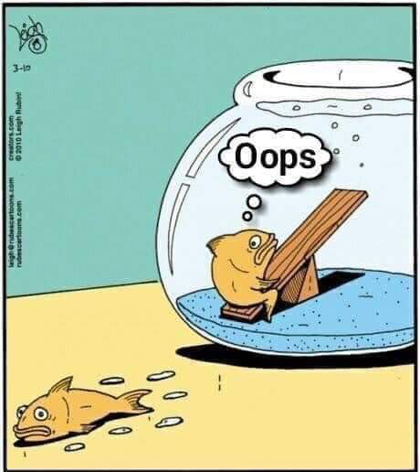

# Object Oriented Programming (OOP)  



**_Object Oriented Programming_** is a concept that provides a way to organize the code into objects, that are the instances of classes . It emphasise the concepts like **abstraction**, **polymorphism**, **encapsulation** and **inheritance** to improve the code reusability and maintanability .   

## Table of contents
-   **[Objects](#objects)**
-   **[Classes](#classes)**
-   **[Data Abstraction & Encapsulation](#data-abstraction--encapsulation)**
-   **[Inheritance](#inheritance)**
-   **[Polymorphism](#polymorphism)**
-   **[Data Binding](#dynamic-binding-late-binding)**
-   **[Message Passing](#message-passing)**


### Classes  

A **class** is a blueprint or template that defines the structure and behavious of an object . It serves as a user define data-types and encapsulate data **_(attributes)_** and method **_(functions)_** that operates on that data.  

**e.g:**  
```cpp
class Strudent {
  // these are the attributes (data)
    private:
      int age;
      int marks;
      string name;
    public:
      // constructor
      Student(string name, int age, int marks) {
        this->name = name;
        this->age = age;
        this->marks = marks;
      }
      void setAge(int age) {
        // logic
      }

      void setMarks(int marks) {
        // logic
      }

      void setName(string name) {
        // logic
      }

      string getName() {
        return name;
      }

      int getMarks() {
        return marks;
      }

      int getAge() {
        return age;
      }
};
```
We have a ***Student*** class and ***setAge***, ***setName*** & ***setMarks*** are the functions.  
for creating object we can write  
```cpp 
Student afzal = new Student("Md Afzal", 300, 21);  
```  

```pgsql
+-------------------------------------------+
|              CLASS: Student               |
+-------------------------------------------+
| A class is a user-defined data type.      |
| It defines a blueprint for objects.       |
|                                           |
| Example Definition:                       |
| class Student {                           |
|     // this is the student class          |
|   };                                      |
+-------------------------------------------+
|        OBJECTS OF CLASS Student           |
+-------------------------------------------+
| These are variables of type 'student':    |
|                                           |
|   Student Afzal();                        |
|   Student Haider();                       |
|   Student Firoz();                        |
+-------------------------------------------+
```  

### Objects  

The **objects** is an instance of a class . It represent a real-world entity and can hold it's own state (attribute) and behaviour (functions) define by the class .  

**e.g:**  

```pgsql
+----------------------+
| Object: STUDENT      |
+----------------------+
| Data:                |
|  - Name              |
|  - dob               |
|  - marks             |
+----------------------+
| Functions:           |
|  - total()           |
|  - avg()             |
|  - display()         |
+----------------------+
```  

### Data Abstraction & Encapsulation  

**Encapsulation**  
The wrapping up of data and function into a single unit (called class) is known as encapsulation.  
The data is not acccessable is outside the world . The function provide interface between the object's data and the program.  
This insulation of data from direct access by the program is called ***data hiding*** or ***information hiding*** .  

**Data Abstraction**  
It refers to the act of representing essential features without including the background details or explanation.  

classes use the concepts of abstraction and are the define such as a list of abstract attributes such as **size**, **weight**, **cost** & function to operate on these attributes.  

```pgsql
+--------------+
|    Example   |
+--------------+

Encapsulation:
--------------
- Wrapping data and functions into a single unit (class).
- Data is hidden from outside access.
- Functions provide controlled interaction with data.
- Enables "Data Hiding" or "Information Hiding".

                +--------------------+
                |      CLASS         |
                +--------------------+
                | - size             |  <-- private data
                | - weight           |
                | - cost             |
                +--------------------+
                | + getDetails()     |  <-- public functions
                | + updateCost()     |
                +--------------------+

Data Abstraction:
-----------------
- Represents essential features only.
- Ignores internal implementation details.
- Focus on "what" an object does, not "how".

  Example:
    - Abstract Attributes: size, weight, cost
    - Abstract Operations: getDetails(), updateCost()

+--------------------------------------------------+
```  

### Inheritance  

Inheritance is a mechanism in which one class inherits the properties & behaviours of another class is known as inheritance . It promotes the reusability and establish an `is-a` relationship between classes .  

The class being inherit from is the **base class** or **super class**, or sometime say **parent class**, and the class inheriting is the **derived class** or **subclass** or sometime says, **child class** .  
*It support the concept of hierarchical classification.*  

**e.g**  
```lua
                    +---------------------+
                    |        Bird         |
                    |---------------------|
                    | - Attributes        |
                    | - Features          |
                    | - Lay Eggs          |
                    +---------------------+
                           /     \
                          /       \
         +----------------+       +-------------------+
         |  Flying Birds  |       | Non Flying Birds  |
         |----------------|       |-------------------|
         | - Attributes   |       | - Attributes      |
         +----------------+       +-------------------+
             /      \                   /       \
            /        \                 /         \
   +-----------+  +-----------+  +----------+  +-----------+
   |   Robin   |  | Swallow   |  |   Kiwi   |  | Penguin   |
   |-----------|  |-----------|  |----------|  |-----------|
   | - Attr.   |  | - Attr.   |  | - Attr.  |  | - Attr.   |
   +-----------+  +-----------+  +----------+  +-----------+
```

#### Types of inheritance  

- **Single Level Inheritance**  
- **Multiple Inheritance**
- **Multilevel Inheritance**
- **Hierarchical Inheritance**
- **Hybrid Inheritance**  

### 1. Single Inheritance  
A child class is aquires the propery and behaviour from one single super class.  
```cpp
#include <iostream>
using namespace std;

class Animal {
    public:
        void eat() {
            cout << "Eating\n";
        }
        void running() {
            cout << "Running...\n";
        }
};


class Dog:public Animal {
    public:
        void bark() {
            cout << "The Dog Is Barking.\n";
        }
};
int main() {
    Dog tomy;

    tomy.bark();
    tomy.eat();
    tomy.running();
    return 0;
}
```  

### 2.Multiple Inheritance  
A class can inherits the properties and behaviours from more than one super class .  
```cpp
#include <iostream>
using namespace std;

class LandVehicle {
public:
    LandVehicle() {
        cout << "This is a LandVehicle"<< endl;
    }
};

class WaterVehicle {
public:
    WaterVehicle() {
        cout << "This is a WaterVehicle"<< endl;
    }
};

// sub class derived from two base classes
class AmphibiousVehicle : public WaterVehicle, public LandVehicle {
  public:
    AmphibiousVehicle() {
        cout << "This is an AmphibiousVehicle"<< endl;
    }
};

int main() {
    AmphibiousVehicle obj;
    return 0;
}
```  

### 3. Multi Level Inheritance  
In multi-level inheritance a derived class is created from another derived class and that derived class can be derived class from a base class or any other deried class . There can be any number of levels in multi-level inheritance.  

```cpp
#include <iostream>
using namespace std;

class Vehicle {
public:
    Vehicle() {
        cout << "This is a Vehicle"<< endl;
    }
};

class fourWheeler : public Vehicle {
public:
    fourWheeler() {
        cout << "4 Wheeler Vehicles"<< endl;
    }
};

class Car : public fourWheeler {
public:
    Car() {
        cout << "This 4 Wheeler Vehical is a Car";
    }
};

int main() {
    Car obj;
    return 0;
}
```  

### 4. Hierarchical Inheritance  
In hierarchical inheritance, more than one **subclass** or **child class** is derived from one _single_ **super class** or **parent class** .  

```cpp
#include <iostream>
using namespace std;

class Vehicle {
public:
    Vehicle() {
        cout << "This is a Vehicle"<< endl;
    }
};

class Car : public Vehicle {
public:
    Car() {
        cout << "This Vehicle is Car"<< endl;
    }
};

class Bus : public Vehicle {
public:
    Bus() {
        cout << "This Vehicle is Bus"<< endl;
    }
};

int main() {
    Car obj1;
    Bus obj2;
    return 0;
}
```  

### 5. Hybrid Inheritance  
Hybrid Inheritance is the combination of more than one type of inheritance, mention above .  
- Combining Hierarchical inheritance and Multiple Inheritance will create hybrid inheritance.  

```cpp
#include <iostream>
using namespace std;

class Vehicle
{
  public:
    Vehicle()
    {
        cout << "This is a Vehicle" << endl;
    }
};

class Fare
{
  public:
    Fare()
    {
        cout << "Fare of Vehicle" << endl;
    }
};

class Car : public Vehicle
{
  public:
    Car()
    {
        cout << "This Vehical is a Car" << endl;
    }
};

class Bus : public Vehicle, public Fare
{
  public:
    Bus()
    {
        cout << "This Vehicle is a Bus with Fare";
    }
};

int main()
{

    // Creating object of sub class will
    // invoke the constructor of base class.
    Bus obj2;
    return 0;
}
```

### Polymorphism  
**Polymorphism** is a *greek work* and made up of two different words, `poly` + `morphism` where poly means **many** & morphism means **forms** . It means that a function with the same name can have many forms and perform different tasks based on instances .  

**example :** let say the operator of addition, for two number it will generate the **sum**, but for two strings it will produce a third different string by concatinating both the string.  

The process of making an operator to exhibit different behaviours in different instances, known as *operator overloading*.  

A function having same name but no of parameters & type of parameters are different and the function perform different works depends on instances, known as *function overloading*.  

**e.g**  

```pgsql
                           +-----------------+
                           |     Shape       |
                           |-----------------|
                           |   Draw()        |
                           +--------+--------+
                                    |
          +-------------------------+---------------------------+
          |                         |                           |
+------------------+   +---------------------+     +-----------------------+
|  Circle Object   |   |  Triangle Object     |     |  Rectangle Object     |
|------------------|   |---------------------|     |-----------------------|
|  Draw(circle)     |   |  Draw(triangle)     |     |  Draw(rectangle)      |
+------------------+   +---------------------+     +-----------------------+
```

### Dynamic Binding *(Late Binding)*  
Dynamic binding is associative with polymorphism and inheritance. A function call associated with a polymorphism referance depends on the dynamic type of the referance .  

### Message Passing  
An object oriented program is consists of a set of objects that communicates with each other. Objects communicate with one another by sending & receiving information.  
*The concept of passing message, make it more easy to talk about building system that directly model or simulate their real-world counterparts*.  
